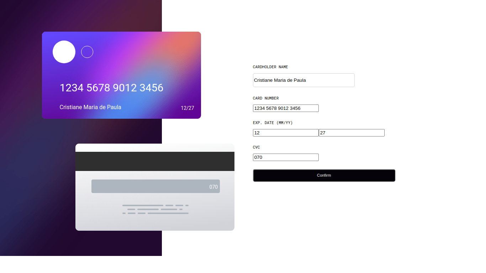

<h1 align="center"> Card </h1>

Interativo

  <a href="#-tecnologias">Tecnologias</a>&nbsp;&nbsp;&nbsp;|&nbsp;&nbsp;&nbsp;
  <a href="#-projeto">Projeto</a>&nbsp;&nbsp;&nbsp;|&nbsp;&nbsp;&nbsp;
  <a href="#-layout">Layout</a>&nbsp;&nbsp;&nbsp;|&nbsp;&nbsp;&nbsp;

  
  <!--  -->
  
  

 

  

## 🚀 Tecnologias

Esse projeto foi desenvolvido com as seguintes tecnologias:

- HTML e CSS
- JavaScript
- React
- Git e Github

## 💻 Projeto

O formulario preenche um cartao de credito simulado.

## 🔖 Layout

Você pode visualizar o layout do projeto através [DESSE LINK](<https://github.com/CristianeNazareth/projeto_card>). É necessário ter conta no [Figma](https://figma.com) para acessá-lo.

